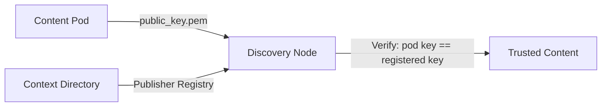

Every piece of content in a Content Pod — individual content items, the manifest, and the checksums file — is cryptographically signed using **Ed25519**. This enables Discovery Nodes and end users to verify that content has not been tampered with and was published by the claimed author.

## Signing Process

<Steps>
  <Step title="Remove existing signature">
    If the JSON object contains a `_signature` field, it is removed before signing.
  </Step>
  <Step title="Canonicalize with JCS">
    The JSON data is serialized using **JSON Canonicalization Scheme (JCS)** — RFC 8785 — to produce deterministic output regardless of key ordering or whitespace.
  </Step>
  <Step title="Compute SHA-256 hash">
    A SHA-256 hash is computed over the canonical JSON bytes.
  </Step>
  <Step title="Sign with Ed25519">
    The hash is signed using the publisher's Ed25519 private key.
  </Step>
  <Step title="Embed signature">
    The signature, content hash, algorithm, timestamp, and public key URL are stored in the `_signature` field.
  </Step>
</Steps>

### Signature Format

```json
{
  "_signature": {
    "algorithm": "Ed25519",
    "signature": "base64-encoded-signature",
    "content_hash": "sha256:a1b2c3d4e5f6...",
    "signed_at": "2026-03-01T12:00:00Z",
    "public_key_url": "/public_key.pem"
  }
}
```

<ResponseField name="algorithm" field-type="string" required="true">
  Always `"Ed25519"`.
</ResponseField>

<ResponseField name="signature" field-type="string" required="true">
  Base64-encoded Ed25519 signature of the content hash.
</ResponseField>

<ResponseField name="content_hash" field-type="string" required="true">
  SHA-256 hash of the canonicalized JSON, prefixed with `sha256:`.
</ResponseField>

<ResponseField name="signed_at" field-type="string" required="true">
  ISO 8601 timestamp of when the content was signed.
</ResponseField>

<ResponseField name="public_key_url" field-type="string" required="true">
  Relative URL to the publisher's public key (typically `/public_key.pem`).
</ResponseField>

## Verification Process

<Steps>
  <Step title="Fetch public key">
    Download the publisher's public key from `public_key_url` on the pod.
  </Step>
  <Step title="Extract signature">
    Remove the `_signature` field from the JSON object.
  </Step>
  <Step title="Canonicalize">
    Serialize the remaining JSON using JCS.
  </Step>
  <Step title="Compute hash">
    Compute SHA-256 over the canonical JSON bytes.
  </Step>
  <Step title="Verify">
    Verify the Ed25519 signature against the computed hash using the publisher's public key.
  </Step>
</Steps>

## Code Examples

<Tabs>
  <Tab title="Signing" icon="lock">
    ```typescript
    import { SigningService } from '@roadbeat/content-pod-generator';

    const signing = new SigningService();

    // Generate a new key pair
    const keyPair = await signing.generateKeyPair();
    // keyPair.publicKey  — PEM-encoded public key (serve at /public_key.pem)
    // keyPair.privateKey — PEM-encoded private key (keep secret!)

    // Sign content
    const contentData = {
      id: 'c_001',
      content_type: 'news',
      slug: 'my-article',
      data: { title: 'My Article', body: '<p>Hello world</p>' },
    };

    const signature = await signing.sign(contentData, keyPair.privateKey);
    // signature = { algorithm, signature, content_hash, signed_at, public_key_url }

    // Attach to content
    contentData._signature = signature;
    ```
  </Tab>
  <Tab title="Verification" icon="shield-check">
    ```typescript
    import { SigningService } from '@roadbeat/content-pod-generator';

    const signing = new SigningService();

    // Verify content
    const result = await signing.verify(contentData, publicKeyPem);
    // result = { valid: true/false, reason?: string }

    if (!result.valid) {
      console.error('Signature verification failed:', result.reason);
    }
    ```
  </Tab>
  <Tab title="Full Integrity Check" icon="check-circle">
    ```typescript
    import { ContentVerificationService } from '@roadbeat/content-pod-generator';

    const verifier = new ContentVerificationService(dataProvider);

    const report = await verifier.verifyPod('pod_xyz789');
    // report.manifest   — manifest signature valid?
    // report.checksums  — checksums file signature valid?
    // report.content[]  — per-item checksum + signature results
    // report.summary    — total, passed, failed, warnings
    ```
  </Tab>
</Tabs>

## Key Management

### Key Rotation

The `KeyManager` service supports key rotation without breaking existing content:

```typescript
import { KeyManager } from '@roadbeat/content-pod-generator';

const keyManager = new KeyManager();

// Add a new key (becomes the active signing key)
const newKeyPair = await keyManager.rotateKey();

// Previous keys remain valid for verification
const allKeys = keyManager.getPublicKeys();
// Returns: [{ keyId, publicKey, createdAt, isActive }]
```

### Trust Chain

Publisher public keys are registered in the **Context Directory**, establishing a trust chain:



<Callout kind="tip">
  Keys are stored in PEM format. The public key must be accessible at `/public_key.pem` on the pod's root URL for automated verification.
</Callout>

## What Gets Signed

| File | Signed? | Notes |
|------|---------|-------|
| `manifest.json` | Yes | Entire manifest except `_signature` field |
| `checksums.json` | Yes | Entire checksums file except `_signature` field |
| `content/*/index.json` | Yes | Each content item individually |
| `content/*/index.html` | No | Covered by checksum in `checksums.json` |
| `content/*/embed.html` | No | Covered by checksum in `checksums.json` |
| `content/*/assets/*` | No | Covered by checksum in `checksums.json` |
