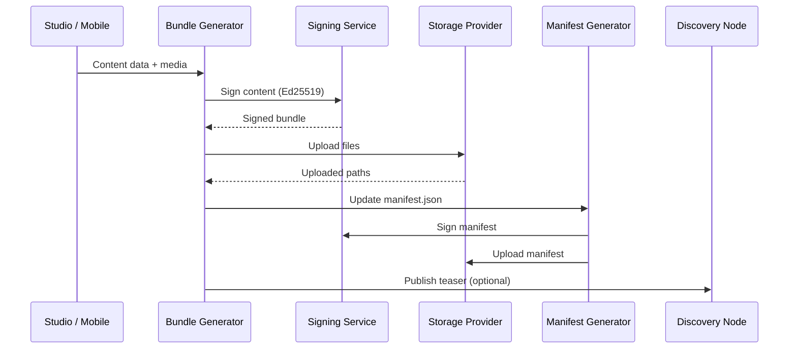

## Content Pod

A **Content Pod** is a portable, static content bundle that acts as the canonical origin for published content. Each pod is a directory of files — structured JSON metadata, rendered HTML pages, embeddable cards, and media assets — served from any static hosting provider.

Pods are identified by a unique `pod_id` and described by a `manifest.json` file at the root.

## Content Bundle

A **bundle** is the output of generating a single content item. Each bundle lives under `content/{contentType}/{slug}/` and contains:

| File | Purpose |
|------|---------|
| `index.json` | Full structured metadata conforming to the content type's JSON Schema |
| `index.html` | Rendered HTML page with SEO tags (Open Graph, Twitter Cards, JSON-LD) |
| `embed.html` | Lightweight embeddable card for sharing on other sites |
| `assets/` | Media files (images in multiple sizes, documents, etc.) |

Bundles are generated by the `BundleGenerator` from the `@roadbeat/content-pod-generator` package using Handlebars templates.

## Content Signing

Every content item and the pod manifest are **cryptographically signed** using Ed25519:

<Steps>
  <Step title="Canonicalize">
    Content data is serialized using JSON Canonicalization Scheme (JCS) for deterministic output.
  </Step>
  <Step title="Hash">
    A SHA-256 hash is computed from the canonical JSON.
  </Step>
  <Step title="Sign">
    The hash is signed with the publisher's Ed25519 private key.
  </Step>
  <Step title="Embed">
    The signature, hash, and metadata are stored in the `_signature` field of the JSON.
  </Step>
</Steps>

Discovery Nodes and clients can verify content authenticity by fetching the publisher's public key from `/public_key.pem` on the pod.

## Storage Providers

Content Pods are **storage-agnostic**. The `@roadbeat/content-pod-storage` package provides adapters for multiple backends:

<Columns cols={3}>
  <Card title="S3-Compatible" icon="cloud">
    AWS S3, Hetzner Object Storage, Contabo Object Storage, MinIO, Backblaze B2.
  </Card>
  <Card title="SFTP" icon="terminal">
    Any server with SSH access — traditional hosting, VPS, shared hosting.
  </Card>
  <Card title="Managed Hosting" icon="server">
    `*.pods.roadbeat.net` — automatic CDN, SSL, storage quotas, and billing.
  </Card>
</Columns>

All providers implement the same `StorageProvider` interface, making it trivial to switch between them.

## Publishing Pipeline

The end-to-end flow from content creation to discovery:

## Service Tiers

Managed pod hosting offers four tiers:

| Tier | Storage | Custom Domains | Dynamic Features | Price |
|------|---------|----------------|------------------|-------|
| **Free** | 5 GB | — | — | €0/mo |
| **Starter** | 25 GB | 1 | Comments, Stats | €5/mo |
| **Pro** | 100 GB | 3 | Full | €15/mo |
| **Enterprise** | Unlimited | Unlimited | Full + SLA | Custom |

## Dynamic Features

While Content Pods are primarily static, publishers who need interactivity can enable **dynamic features**:

- **Comments** — threaded, moderated, spam-filtered (Akismet)
- **Reactions** — configurable types (like, love, insightful, bookmark)
- **Statistics** — GDPR-compliant page views with IP anonymization
- **Newsletter** — double opt-in email subscriptions
- **RSS** — auto-generated feeds filterable by type, tag, and language

These are provided by the `@roadbeat/dynamic-features` package and use a generic `DatabaseAdapter` interface.

## Portability

Content Pods are designed to be **fully portable**:

- **Export** — full, selective, or incremental exports as ZIP archives
- **Import** — with conflict resolution (skip, overwrite, rename)
- **Migrate** — 6-phase pipeline with progress tracking and zero-downtime support
- **Backup** — full and incremental backups with cross-region storage and point-in-time recovery

See the [Portability & Migration](/guides/portability) guide for details.