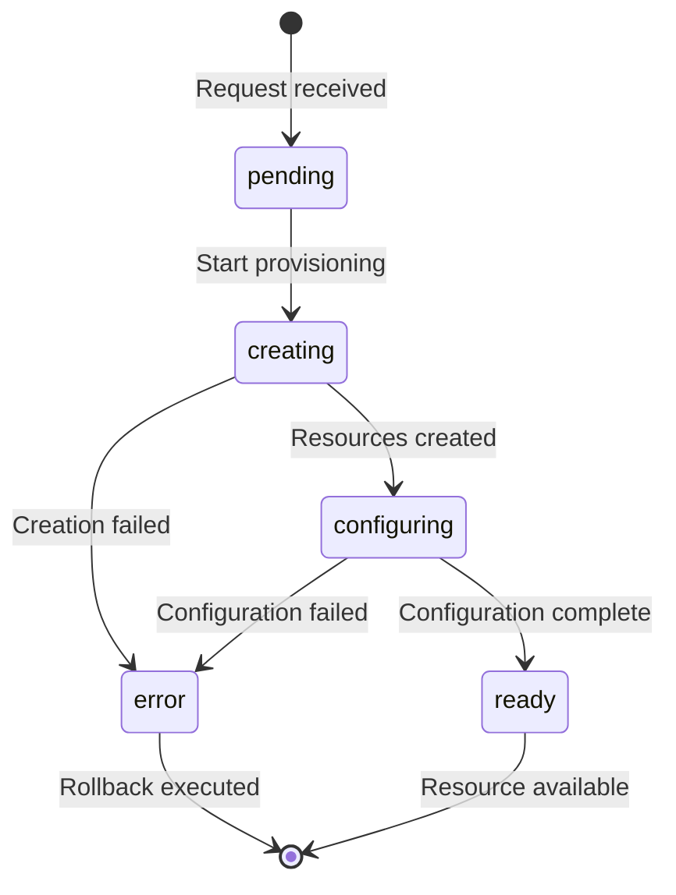

The **Cloud Provisioner** automates infrastructure setup for self-hosted Content Pods. It supports Hetzner Cloud and Contabo as first-class providers, with a common abstraction layer for multi-provider deployments.

## Supported Providers

| Capability | Hetzner Cloud | Contabo |
|-----------|---------------|---------|
| **VPS Servers** | CX11 – CX51 | VPS S – VPS XL |
| **Object Storage** | S3-compatible (fsn1, nbg1, hel1) | S3-compatible (EU, US, SIN) |
| **SSH Key Management** | API-native | Secrets API |
| **Firewalls** | API-native | Security groups |
| **DNS** | via Cloudflare | Native DNS API |
| **Authentication** | Bearer token | OAuth 2.0 |

## Provisioning Workflow

The provisioner implements a state machine with automatic rollback on failure:



## What Gets Provisioned

<Tabs>
  <Tab title="Studio Node" icon="server">
    A full roadbeat Studio deployment on a VPS:

    - Ubuntu 22.04 with Docker, Caddy (auto-TLS), fail2ban, ufw
    - SSH key authentication (password login disabled)
    - Firewall: ports 22 (SSH), 80 (HTTP), 443 (HTTPS)
    - Cloud-init for automated setup

    ```bash
    curl -X POST http://localhost:3402/api/v1/provision/studio-node \
      -H "Authorization: Bearer YOUR_TOKEN" \
      -H "Content-Type: application/json" \
      -d '{
        "name": "my-studio",
        "provider": "hetzner",
        "serverType": "cx22",
        "location": "fsn1",
        "domain": "studio.example.com",
        "sshPublicKey": "ssh-ed25519 AAAA..."
      }'
    ```
  </Tab>

  <Tab title="Pod Storage" icon="hard-drive">
    S3-compatible object storage for pod content:

    - Bucket with public read access
    - CORS configured for JSON endpoints
    - Cache-control headers pre-configured

    ```bash
    curl -X POST http://localhost:3402/api/v1/provision/content-pod/storage \
      -H "Authorization: Bearer YOUR_TOKEN" \
      -H "Content-Type: application/json" \
      -d '{
        "name": "my-pod-storage",
        "provider": "hetzner",
        "region": "fsn1"
      }'
    ```
  </Tab>

  <Tab title="Pod Server" icon="globe">
    A VPS for hosting static or dynamic Content Pods:

    - Caddy web server with automatic SSL
    - Static file serving or Node.js runtime for dynamic features
    - Cloud-init template for pod-specific configuration

    ```bash
    curl -X POST http://localhost:3402/api/v1/provision/content-pod/server \
      -H "Authorization: Bearer YOUR_TOKEN" \
      -H "Content-Type: application/json" \
      -d '{
        "name": "my-pod-server",
        "provider": "contabo",
        "serverType": "VPS S",
        "region": "EU",
        "domain": "blog.example.com",
        "sshPublicKey": "ssh-ed25519 AAAA...",
        "dynamic": true
      }'
    ```
  </Tab>
</Tabs>

## Resource Management

### List Resources

```bash
curl http://localhost:3402/api/v1/provision/resources \
  -H "Authorization: Bearer YOUR_TOKEN"
```

### Check Status

```bash
curl http://localhost:3402/api/v1/provision/resources/res_abc123/status \
  -H "Authorization: Bearer YOUR_TOKEN"
```

```json
{
  "id": "res_abc123",
  "type": "studio-node",
  "provider": "hetzner",
  "status": "ready",
  "ipv4": "203.0.113.42",
  "domain": "studio.example.com",
  "createdAt": "2026-03-02T12:00:00Z"
}
```

### Server Actions

```bash
# Stop, start, or reboot a server
curl -X POST http://localhost:3402/api/v1/provision/resources/res_abc123/action \
  -H "Authorization: Bearer YOUR_TOKEN" \
  -H "Content-Type: application/json" \
  -d '{ "action": "reboot" }'
```

### Deprovision

```bash
curl -X DELETE http://localhost:3402/api/v1/provision/resources/res_abc123 \
  -H "Authorization: Bearer YOUR_TOKEN"
```

<Callout kind="danger">
  Deprovisioning permanently deletes the server and all data on it. Always export your Content Pod before deprovisioning.
</Callout>

## Cost Estimation

Get a monthly cost estimate before provisioning:

```bash
curl "http://localhost:3402/api/v1/provision/cost-estimate?provider=hetzner&serverType=cx22" \
  -H "Authorization: Bearer YOUR_TOKEN"
```

## DNS Management

The provisioner integrates with Cloudflare (for Hetzner) and Contabo's native DNS API to automatically create:

- **A record** — pointing to the server's IPv4
- **AAAA record** — pointing to the server's IPv6
- **CNAME record** — for `www` subdomain (optional)

## Configuration

Set provider credentials via environment variables:

<Tabs>
  <Tab title="Hetzner" icon="key">
    ```bash
    HETZNER_API_TOKEN=your-api-token
    HETZNER_DEFAULT_LOCATION=fsn1        # fsn1 | nbg1 | hel1
    HETZNER_DEFAULT_SERVER_TYPE=cx22
    ```
  </Tab>
  <Tab title="Contabo" icon="key">
    ```bash
    CONTABO_CLIENT_ID=your-client-id
    CONTABO_CLIENT_SECRET=your-secret
    CONTABO_API_USER=your-api-user
    CONTABO_API_PASSWORD=your-api-password
    CONTABO_DEFAULT_REGION=EU            # EU | US-central | SIN
    ```
  </Tab>
</Tabs>

Both providers can be configured simultaneously for multi-provider redundancy.
