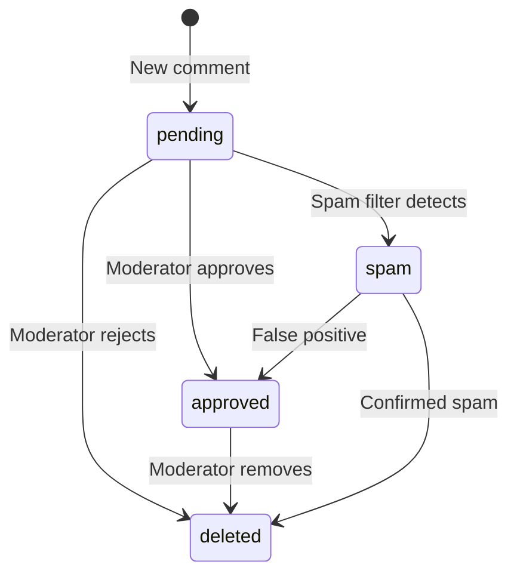

While Content Pods are primarily static, the `@roadbeat/dynamic-features` package provides optional server-side interactivity. These features use a generic `DatabaseAdapter` interface and can run on any backend that supports SQL.

<Callout kind="info">
  Dynamic features require a **Starter** tier or higher on managed hosting. Self-hosted pods can enable them with any database backend.
</Callout>

## Available Features

<Columns cols={3}>
  <Card title="Comments" icon="message-circle">
    Threaded comments with moderation queue and Akismet spam detection.
  </Card>
  <Card title="Reactions" icon="heart">
    Configurable reaction types — like, love, insightful, bookmark — with session dedup.
  </Card>
  <Card title="Statistics" icon="bar-chart-3">
    GDPR-compliant page views with IP anonymization, referrers, and reading time.
  </Card>
</Columns>

<Columns cols={2}>
  <Card title="Newsletter" icon="mail">
    Double opt-in email subscriptions with confirmation flow and unsubscribe.
  </Card>
  <Card title="RSS Feeds" icon="rss">
    Auto-generated RSS 2.0 + Atom feeds, filterable by content type, tag, and language.
  </Card>
</Columns>

## Database Adapter

All dynamic features communicate with the database through a `DatabaseAdapter` interface:

```typescript
interface DatabaseAdapter {
  query(sql: string, params?: unknown[]): Promise<any[]>;
  execute(sql: string, params?: unknown[]): Promise<{ rowsAffected: number }>;
  transaction<T>(fn: (adapter: DatabaseAdapter) => Promise<T>): Promise<T>;
}
```

The adapter is database-agnostic — use it with PostgreSQL, MySQL, SQLite, or any SQL-compatible database.

## Comments

The `CommentsService` provides threaded comments with a moderation pipeline.

```typescript
import { CommentsService } from '@roadbeat/dynamic-features';

const comments = new CommentsService(dbAdapter, {
  moderation: 'manual',       // 'manual' | 'auto-approve'
  requireEmail: true,
  allowAnonymous: false,
  spamFilter: 'akismet',
  maxDepth: 3,
});

// Submit a comment
const comment = await comments.create({
  contentId: 'c_001',
  authorName: 'Jane',
  authorEmail: 'jane@example.com',
  content: 'Great article!',
});

// Approve / reject
await comments.moderate(comment.id, 'approved');

// Fetch approved comments for a content item
const thread = await comments.getByContent('c_001');
```

### Comment Lifecycle



## Reactions

The `ReactionsService` supports configurable reaction types with session-based deduplication.

```typescript
import { ReactionsService } from '@roadbeat/dynamic-features';

const reactions = new ReactionsService(dbAdapter, {
  types: ['like', 'love', 'insightful', 'bookmark'],
  requireAuth: false,
  rateLimit: '10/minute',
});

// Add a reaction
await reactions.add('c_001', 'like', sessionId);

// Get counts for a content item
const counts = await reactions.getCounts('c_001');
// { like: 42, love: 7, insightful: 3, bookmark: 12 }
```

<Callout kind="tip">
  Reactions are deduplicated per session — a user can only react once per type per content item. No login required for readers.
</Callout>

## Statistics

The `StatisticsService` tracks page views with full GDPR compliance.

```typescript
import { StatisticsService } from '@roadbeat/dynamic-features';

const stats = new StatisticsService(dbAdapter, {
  trackViews: true,
  trackReferrers: true,
  trackReadingTime: true,
  anonymizeIp: true,          // Last octet removed before storage
  retentionDays: 365,
  gdprCompliant: true,
});

// Record a page view
await stats.recordView({
  contentId: 'c_001',
  ip: '192.168.1.0',          // Already anonymized
  referrer: 'https://google.com',
  readingTimeSeconds: 180,
  country: 'DE',
});

// Get statistics
const contentStats = await stats.getStats('c_001', { period: '30d' });
```

### Privacy by Design

- **IP anonymization** — last octet removed before storage (e.g., `192.168.1.123` → `192.168.1.0`)
- **No personal tracking** — session-based, not user-based
- **Configurable retention** — automatic deletion after N days
- **No cookies** — works without cookie consent banners
- **EU data residency** — Hetzner/EU providers by default

## Newsletter

The `NewsletterService` handles email subscriptions with double opt-in.

```typescript
import { NewsletterService } from '@roadbeat/dynamic-features';

const newsletter = new NewsletterService(dbAdapter, {
  doubleOptIn: true,
});

// Subscribe
const result = await newsletter.subscribe('reader@example.com', 'Jane');
// result.confirmToken — send via email for verification

// Confirm subscription
await newsletter.confirm(result.confirmToken);

// Unsubscribe
await newsletter.unsubscribe('reader@example.com');
```

## RSS Feeds

The `RssService` generates RSS 2.0 and Atom feeds from the pod manifest.

```typescript
import { RssService } from '@roadbeat/dynamic-features';

const rss = new RssService({
  itemsCount: 20,
  fullContent: false,
});

// Generate RSS feed
const feed = rss.generate(manifest, {
  format: 'rss',              // 'rss' | 'atom'
  contentType: 'news',        // Optional filter
  tag: 'travel',              // Optional filter
  language: 'en',             // Optional filter
});
```

## Database Migrations

The `MigrationRunner` creates the required database tables for dynamic features:

```typescript
import { MigrationRunner, MIGRATIONS } from '@roadbeat/dynamic-features';

const runner = new MigrationRunner(dbAdapter);
await runner.run(MIGRATIONS);
```

This creates tables for comments, reactions, page views, subscribers, and related data.

## Client-Side Integration

Static HTML templates can integrate dynamic features via JavaScript:

```html
<div id="roadbeat-reactions" data-content-id="c_001"></div>
<div id="roadbeat-comments" data-content-id="c_001"></div>

<script src="/_dynamic/js/roadbeat-dynamic.js"></script>
<script>
  roadbeatDynamic.init({
    contentId: 'c_001',
    apiBase: '/_dynamic/api',
    features: {
      comments: true,
      reactions: true,
      stats: true,
    },
  });
</script>
```
