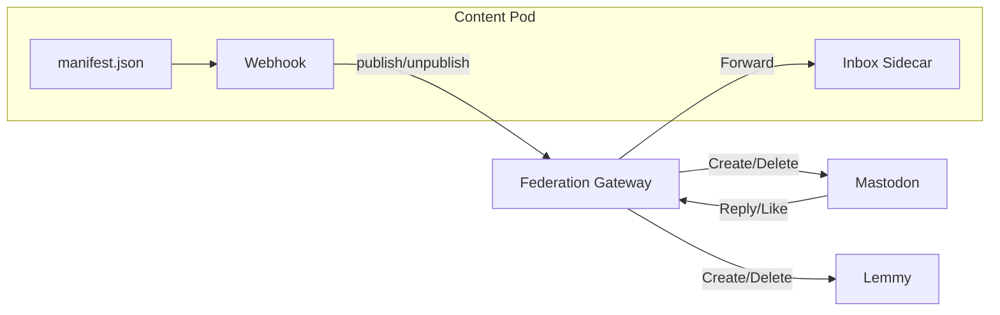

## Overview

Every Content Pod can have its own **ActivityPub identity**. When federation is enabled, users on Mastodon, Lemmy, Pleroma, and other Fediverse servers can follow your pod and receive new content as it's published.

<Callout kind="info">
  Pod federation is managed by the **Federation Gateway** service. Managed pods on `*.pods.roadbeat.net` have federation enabled automatically. Self-hosted pods need a gateway connection configured.
</Callout>



## Pod Actor

When your pod is set up, the gateway provisions a dedicated ActivityPub actor with:

- **Handle** — e.g. `@my-blog-pod@federation.roadbeat.net`
- **Actor IRI** — the canonical URL identifying the actor
- **Key pair** — RSA-2048 stored encrypted in the gateway (exportable)
- **Outbox** — serves published content as ActivityStreams objects
- **Followers collection** — tracks remote followers

The actor information is stored in your pod's `manifest.json` under the `_activitypub` key:

```json
{
  "_activitypub": {
    "actorIri": "https://federation.roadbeat.net/ap/users/my-blog-pod",
    "handle": "@my-blog-pod@federation.roadbeat.net",
    "outboxUrl": "https://federation.roadbeat.net/ap/users/my-blog-pod/outbox",
    "followersUrl": "https://federation.roadbeat.net/ap/users/my-blog-pod/followers"
  }
}
```

## Publishing to Followers

When you publish content to your pod, a webhook notifies the gateway. The gateway:

<Steps>
  <Step title="Receives webhook" icon="webhook">
    Studio or the mobile app sends a webhook with the content entry metadata (id, title, slug, content type, publication date).
  </Step>
  <Step title="Maps to ActivityStreams" icon="code">
    The entry is converted to an AS2 object (typically `Article`) with the appropriate properties and a link back to the pod's content URL.
  </Step>
  <Step title="Delivers to followers" icon="send">
    A `Create` activity wrapping the object is delivered to all follower inboxes via signed HTTP POST with exponential backoff retry.
  </Step>
</Steps>

Content updates emit `Update` activities; unpublishing emits `Delete` activities.

## Receiving Interactions

Your pod can receive replies, likes, and boosts from the Fediverse. How they're handled depends on your pod mode:

<Tabs>
  <Tab title="Dynamic Pods" icon="sparkles">
    Dynamic pods (with server-side features enabled) have a **PHP inbox sidecar** that processes inbound activities directly:

    - Replies (Notes with `inReplyTo`) are stored in the pod's local SQLite database
    - Likes and Announces (boosts) are tallied per content item
    - The sidecar is available at `/_dynamic/api/activitypub-inbox.php`
    - Authentication uses HMAC tokens shared between gateway and sidecar

    Query replies for a content item:
    ```bash
    GET /_dynamic/api/activitypub-inbox.php?content_id=my-article-slug
    ```
  </Tab>
  <Tab title="Static Pods" icon="file-text">
    Static pods cannot run server-side code, so the gateway handles the inbox:

    - Replies and reactions are stored in the gateway's database (**reply mirroring**)
    - Studio and mobile can read mirrored interactions via the admin API
    - The pod owner sees federated replies alongside native comments in the management UI

    Query mirrored replies:
    ```bash
    GET /admin/pods/{actorId}/replies?content_id=my-article-slug
    GET /admin/pods/{actorId}/reactions?content_id=my-article-slug
    ```
  </Tab>
</Tabs>

## Enabling the Inbox Sidecar

To enable the ActivityPub inbox on a dynamic pod, update your pod's `config.json`:

```json
{
  "dynamic_features": {
    "features": {
      "activitypub_inbox": {
        "enabled": true,
        "auto_approve_replies": true,
        "store_raw_activities": true
      }
    }
  }
}
```

The inbox token is automatically generated and stored in `_dynamic/data/config.json` during pod setup.

## Pod Migration

Content Pods can migrate between hosts while preserving their Fediverse identity and followers. Migration uses the ActivityPub `Move` activity (compatible with Mastodon, Pleroma, and other servers).

<Steps>
  <Step title="Set up new pod" icon="plus">
    Deploy the pod on the new host and provision a new actor. Set `alsoKnownAs` on the new actor pointing to the old actor IRI.
  </Step>
  <Step title="Initiate Move" icon="arrow-right">
    Call the migration endpoint on the old gateway. This sets `alsoKnownAs` on the old actor and delivers a `Move` activity to all followers.
  </Step>
  <Step title="Wait for overlap" icon="clock">
    Both actors remain live for **365 days**. Remote servers update follower records. The old actor shows `movedTo` pointing to the new one.
  </Step>
  <Step title="Finalize" icon="check-circle">
    After the overlap period expires, disable federation on the old actor. It can then be safely deleted.
  </Step>
</Steps>

<Callout kind="alert">
  The bidirectional `alsoKnownAs` link is mandatory. Remote servers will reject the Move if the new actor doesn't reference the old one.
</Callout>

### Migration API

| Method | Path | Description |
|--------|------|-------------|
| `POST` | `/admin/pods/:actorId/also-known-as` | Set alsoKnownAs (prepare new actor) |
| `POST` | `/admin/pods/:actorId/migrate` | Initiate Move + notify followers |
| `GET` | `/admin/pods/:actorId/migration-status` | Check migration state |
| `POST` | `/admin/pods/:actorId/finalize-migration` | Disable old actor after overlap |

### Key Export

For self-hosted migrations, export the pod actor's key pair:

```bash
POST /admin/pods/{podConfigId}/export-key
```

This returns the RSA private key in PEM format, which you can import into your new instance to prove identity continuity.

## Environment Variables

| Variable | Default | Description |
|----------|---------|-------------|
| `FEDERATION_GATEWAY_URL` | — | URL of the Federation Gateway admin API |
| `FED_ADMIN_TOKEN` | — | Shared admin token for gateway authentication |
| `POD_INBOX_SECRET` | — | HMAC secret for sidecar token derivation |
| `POD_MIGRATION_OVERLAP_DAYS` | `365` | Days old actor stays live after Move |
| `POD_SIDECAR_TIMEOUT_MS` | `5000` | HTTP timeout for sidecar forwarding |
| `POD_HOST_TEMPLATE` | — | URL template for roadbeat-hosted pods |

## Security

- **HTTP Signatures** — all outbound deliveries are signed; all inbound activities are signature-verified
- **HMAC sidecar auth** — the inbox sidecar only accepts forwarded activities from the gateway
- **Key encryption** — private keys are encrypted at rest (AES-256-GCM)
- **Bidirectional Move verification** — prevents unauthorized actor claiming
- **HTML sanitization** — inbound reply content is stripped of unsafe HTML before storage
