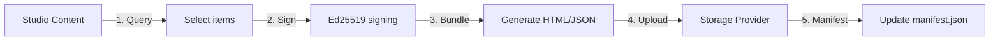

The `@roadbeat/studio-integration` package bridges Content Pods with the roadbeat Studio CMS and Discovery Nodes. It provides three services for exporting content, publishing teasers, and rendering layouts.

## Export Pipeline

The `ContentPodExportService` orchestrates full bundle generation from Studio content:



### Creating an Export Job

```typescript
import { ContentPodExportService } from '@roadbeat/studio-integration';

const exportService = new ContentPodExportService(contentProvider);

// Create a job
const job = exportService.createJob({
  contentTypes: ['news', 'event'],      // Filter by content type
  status: 'published',                   // Only published content
  locales: ['en', 'de'],                // Filter by locale
  dateFrom: '2026-01-01',               // Filter by date range
  dateTo: '2026-03-01',
  signingKeyId: 'key_abc123',           // Ed25519 signing key
  destination: 'storage',                // 'storage' | 'download' | 'managed'
}, organizationId, userId);

// Execute the job
const result = await exportService.executeJob(job.id);
```

### Export Job Phases

<Steps>
  <Step title="Selecting">
    Query content matching the configured filters (content types, status, locales, date range).
  </Step>
  <Step title="Bundling">
    For each content item: generate `index.json` (signed), `index.html` (rendered via Handlebars), `embed.html`, and copy media assets.
  </Step>
  <Step title="Manifest">
    Generate or update `manifest.json` with updated content index, statistics, and signature.
  </Step>
</Steps>

### Export Result

```typescript
interface ExportResult {
  totalItems: number;
  totalSizeBytes: number;
  totalFiles: number;
  items: ExportItemResult[];     // Per-item success/failure + size
  duration: number;               // Milliseconds
}
```

### Monitoring Progress

```typescript
const job = exportService.getJob(jobId);

// job.progress contains:
// {
//   totalItems: 42,
//   processedItems: 15,
//   phase: 'bundling',          // 'selecting' | 'bundling' | 'manifest'
//   percent: 35.7
// }
```

## Discovery Node Publishing

The `DiscoveryIntegrationService` publishes, updates, and removes teasers on Discovery Nodes. Teasers are lightweight summaries that link back to your pod as the canonical source.

```typescript
import { DiscoveryIntegrationService } from '@roadbeat/studio-integration';

const discovery = new DiscoveryIntegrationService(httpClient);

// Publish a teaser
const result = await discovery.publish({
  contentId: 'c_001',
  contentType: 'news',
  slug: 'hidden-beaches-portugal',
  title: { en: '5 Hidden Beaches in Portugal' },
  description: { en: 'Discover the most beautiful secret beaches...' },
  canonicalUrl: 'https://alice.pods.roadbeat.net/content/news/hidden-beaches-portugal/',
  publisherId: 'pub_abc123',
  discoveryNodeUrls: ['https://travel-eu-1.roadbeat.net', 'https://news-eu-1.roadbeat.net'],
});

// Update a teaser (e.g., after migration to a new URL)
await discovery.update({
  contentId: 'c_001',
  canonicalUrl: 'https://new-host.example.com/content/news/hidden-beaches-portugal/',
  discoveryNodeUrls: result.publishedNodes,
});

// Remove a teaser
await discovery.unpublish({
  contentId: 'c_001',
  discoveryNodeUrls: result.publishedNodes,
});
```

<Callout kind="info">
  Teasers include the pod's canonical URL so that Discovery Node users are directed to your pod to read the full content. This keeps you in control of the reader experience.
</Callout>

## Layout Export

The `LayoutExportService` renders content using region-based layouts from the Studio's layout system, with fallback to content-type-specific Handlebars templates.

```typescript
import { LayoutExportService } from '@roadbeat/studio-integration';

const layoutExport = new LayoutExportService(templateEngine);

const html = await layoutExport.render({
  content: studioContent,
  layout: layoutDefinition,       // Optional — falls back to content type template
  locale: 'en',
  baseUrl: 'https://alice.pods.roadbeat.net',
});
```

### Layout Regions

Layouts define regions that map to content fields:

| Region Type | Description |
|------------|-------------|
| `hero-image` | Full-width header image |
| `title` | Content title (H1) |
| `body-text` | Main content body |
| `metadata-strip` | Author, date, reading time |
| `tag-list` | Content tags and categories |
| `image` | Inline image with caption |
| `sidebar-layout` | Two-column layout with sidebar |

## Publishing from Studio UI

When using roadbeat Studio, the export flow is integrated into the CMS:

<Steps>
  <Step title="Open Content Export">
    Navigate to **Content → Export → Content Pod** in the Studio dashboard.
  </Step>
  <Step title="Select content">
    Filter by content type, status, locale, and date range. Select individual items or export all.
  </Step>
  <Step title="Choose destination">
    Select your pod as the export destination — managed hosting, S3 bucket, or SFTP server.
  </Step>
  <Step title="Export">
    Click **Export**. The Studio generates signed bundles, uploads them, updates the manifest, and optionally publishes teasers to Discovery Nodes.
  </Step>
</Steps>

## Content Provider Interface

The export service requires a `StudioContentProvider` that abstracts access to Studio content:

```typescript
interface StudioContentProvider {
  queryContent(filters: ContentQueryFilters): Promise<StudioContent[]>;
  getMedia(contentId: string): Promise<StudioMedia[]>;
  getSigningKey(keyId: string): Promise<{ privateKey: string; publicKeyUrl: string; keyId: string }>;
}
```

This is implemented by the Studio's backend modules. If building a custom integration, implement this interface to connect any CMS to the Content Pod export pipeline.
