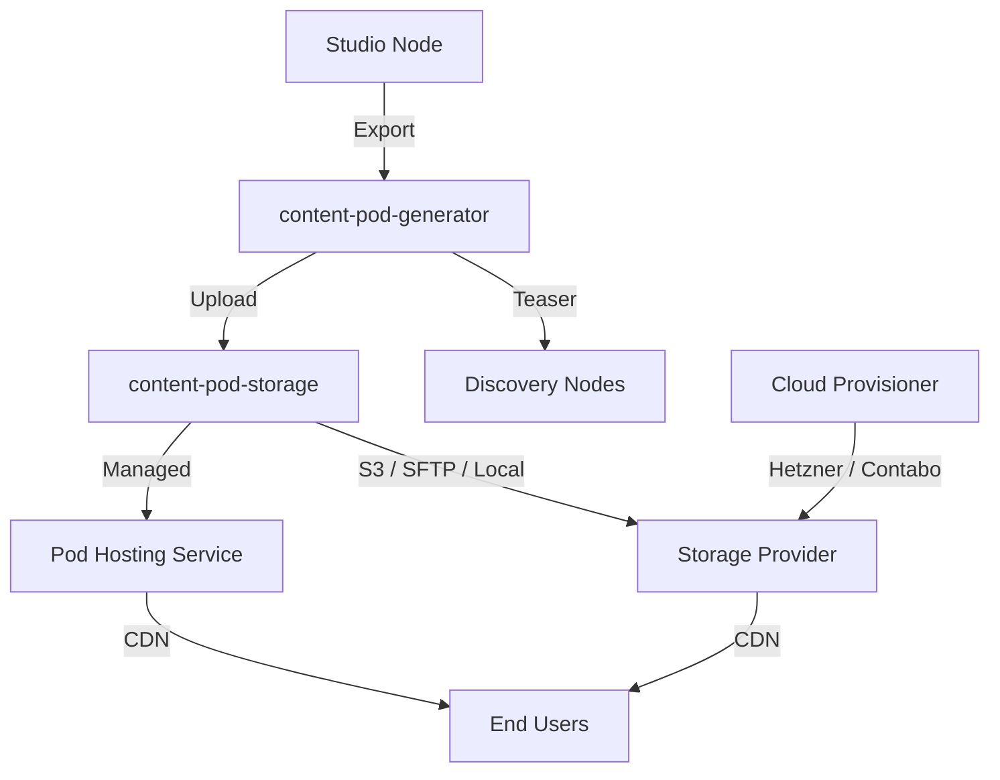

The **roadbeat Content Pod** is a portable, static content hosting solution for individual publishers. It generates signed content bundles — HTML, JSON metadata, and media assets — that serve as the canonical origin for your published content, discoverable via roadbeat Discovery Nodes.

Content Pods embody the roadbeat principle of **data sovereignty**: your content lives where you control it, not on a platform that can change terms, throttle access, or disappear.

<Callout kind="info">
  Content Pods are designed for individual publishers who don't operate their own Studio Node. Organizations with teams and workflows should use [roadbeat Studio](https://docs.roadbeat.net/studio) instead.
</Callout>

## Why Content Pods?

<Columns cols={3}>
  <Card title="Portable" icon="arrow-right-left" href="/concepts">
    Export and move between hosting providers at any time. You are never locked in.
  </Card>
  <Card title="Signed & Verified" icon="shield-check" href="/architecture/content-signing">
    Every piece of content is cryptographically signed with Ed25519 for authenticity.
  </Card>
  <Card title="Discoverable" icon="search" href="/guides/studio-integration">
    Teasers published to Discovery Nodes link back to your pod as the canonical source.
  </Card>
</Columns>

<Columns cols={3}>
  <Card title="Static & Fast" icon="zap" href="/architecture/pod-structure">
    Pre-rendered HTML and JSON — no server-side processing, no vulnerabilities.
  </Card>
  <Card title="Optional Interactivity" icon="sparkles" href="/guides/dynamic-features">
    Add comments, reactions, statistics, newsletters, and RSS when you need them.
  </Card>
  <Card title="European Hosting" icon="globe" href="/guides/managed-hosting">
    Managed hosting on European infrastructure with automatic CDN and SSL.
  </Card>
</Columns>

## Architecture at a Glance

The Content Pod ecosystem is a monorepo with **6 packages** and **3 applications**, totalling over 500 tests:

## Get Started

<Columns cols={2}>
  <Card title="Quickstart" icon="zap" href="/quickstart">
    Create your first Content Pod and publish content in minutes.
  </Card>
  <Card title="Core Concepts" icon="layers" href="/concepts">
    Understand pods, bundles, signing, storage providers, and the publishing pipeline.
  </Card>
  <Card title="API Reference" icon="code" href="/api-reference/overview">
    Explore the Pod Hosting and Cloud Provisioner REST APIs.
  </Card>
  <Card title="Self-Hosting" icon="terminal" href="/deployment/self-hosting">
    Run the full stack with Docker Compose.
  </Card>
</Columns>
